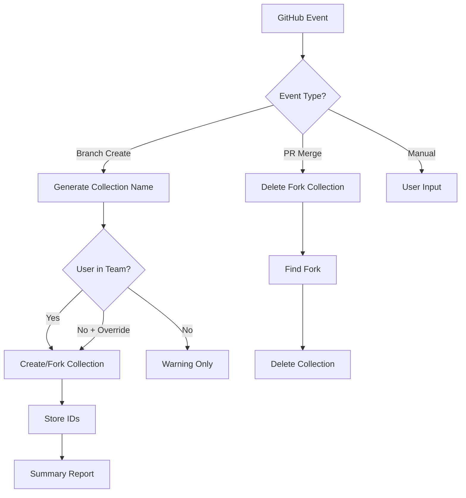

# Postman-GitHub Actions Reference

## Overview

Github Actions-based automation for creating Postman collections when developers create repositories and branches, automatically creating and forking collections for branch-based development. 

This solution, as-is, organizes workspaces with one per repository, enforces team-based validation to ensure only authorized users create resources, and manages the complete lifecycle with automatic cleanup of fork collections upon PR merge.

- Automatically creates workspaces when repositories are initialized and establishes `[org] repo-name #main` collections as the source of truth. 
- Auto-forks collections for `feature/*`, `bugfix/*`, and `hotfix/*` branches with smart detection that identifies branch patterns and forks from master automatically.
- Triggers seamlessly on branch creation, push events, and PR merges while using GitHub context variables for email resolution. Stores workspace IDs in repository variables for persistence and supports manual workflow dispatch for ad-hoc creation needs.
- Consistent, deterministic naming across the organization follows the pattern: `[organization] repository-name` for workspaces, `[organization] repository-name #main` for master collections, and `[organization] repository-name #feature-description` for branch-specific forks.
- Integration with the Postman API allows for automated resource creation for licensed Postman team members, yet allows unlicensed users to continue workflows. This approach balances automation for team members with manual overrides for external contributors and administrators.

### Fork Lifecycle Management
- Automatic fork deletion when pull requests are merged. This keeps workspaces clean and organized, assets easy-to-find, and reduces clutter from temporary branch collections.

## Installation

### Prerequisites
Requires GitHub Enterprise or GitHub.com repository access, a Postman Team or Enterprise account, and repository admin permissions for secrets configuration.

### Setup Steps

1. **Copy Integration Files**

   **Note**: The GitHub Actions workflows are stored in `github-reference/` to prevent automatic execution on this reference repository.
   
   ```bash
   # First, rename the reference directory to activate GitHub Actions
   mv github-reference .github
   
   # Copy the workflow and scripts to your repository  
   cp -r .github/workflows/postman-sync.yml <your-repo>/.github/workflows/
   cp -r scripts/create-postman-resources.js <your-repo>/scripts/
   ```

2. **Configure GitHub Secrets**
```bash
# Required: Your Postman API key
gh secret set POSTMAN_API_KEY --body "your-postman-api-key"

# Optional: GitHub token (improves email resolution)
gh secret set GITHUB_TOKEN --body "your-github-token"
```

3. **Configure Repository Variables** (Optional)
```bash
# Allow all users to create resources (bypasses team check)
gh variable set POSTMAN_ALLOW_ALL_USERS --body "false"
```

4. **Workspace Setup** (Optional)

**Default**: Workspace auto-created when first branch is pushed

**Override** (Optional): Use existing workspace instead of auto-creating
```bash
# Point to existing workspace (if you want to share across repos)
gh variable set POSTMAN_WORKSPACE_ID --body "existing-workspace-uuid"

# Useful for:
# - Multiple repositories in one workspace
# - Existing team workspace
# - Shared documentation space
```

## Usage

### Automatic Triggers

The workflow automatically runs when:

1. **Repository Initialization**: Push to main/master creates workspace + master collection
```bash
git push origin main
# Auto-creates: [org] repo workspace  
# Auto-creates: [org] repo #main collection
# Ready for feature branch workflow
```

2. **Feature Branch Creation**: Auto-creates fork collection from master
```bash
git checkout -b feature/new-api
git push origin feature/new-api
# Auto-creates: [org] repo #feature-new-api (forked from #main)
```

3. **Subsequent Branches**: Creates more fork collections from master
```bash
git checkout -b feature/another-api  
git push origin feature/another-api
# Creates: [org] repo #feature-another-api (forked from #main)
```

4. **Pull Request Merge**: Cleans up fork collection
```bash
# When PR is merged to main
# Deletes: [org] repo #feature-new-api collection
```

### Manual Triggers

Use GitHub Actions UI or CLI for manual operations:

```bash
# Create custom collection in workspace
gh workflow run postman-sync.yml \
  -f action=create-collection \
  -f resource_name="Custom Collection Name"

# Create workspace manually (only if you want custom naming)
gh workflow run postman-sync.yml \
  -f action=create-workspace
```

## Enterprise Deployment

### Organization-Wide Rollout

1. **Create Reusable Workflow**
```yaml
# .github/workflows/postman-sync-reusable.yml
name: Postman Sync (Reusable)
on:
  workflow_call:
    secrets:
      POSTMAN_API_KEY:
        required: true
```

2. **Reference in Repositories**
```yaml
# Individual repo's .github/workflows/postman.yml
name: Postman Integration
on:
  push:
    branches: [feature/**, bugfix/**, hotfix/**]
  create:
  pull_request:
    types: [closed]

jobs:
  sync:
    uses: org/.github/.github/workflows/postman-sync-reusable.yml@main
    secrets: inherit
```

### Options

- Set `POSTMAN_ALLOW_ALL_USERS=true` in repository variables to allow all GitHub users to create Postman resources. This approach works well for teams with just-in-time provisioning of Postman licenses.

## Configuration Reference

### Environment Variables
| Variable | Required | Description |
|----------|----------|-------------|
| `POSTMAN_API_KEY` | Yes | Service Account/Admin Postman API key with workspace/collection permissions |
| `POSTMAN_WORKSPACE_ID` | Yes | Workspace UUID - auto-stored after workspace creation OR manually set for existing workspace |
| `POSTMAN_ALLOW_ALL_USERS` | No | Set to `true` to bypass team membership validation |

### Workflow Inputs
| Input | Description | Default |
|-------|-------------|---------|
| `action` | `create-workspace` or `create-collection` | Required |
| `resource_name` | Name of workspace/collection | Auto-generated |
| `workspace_id` | Target workspace for collections | From variables |

## Architecture

### Workflow Logic


### Authorization and User Validation

- **API Key Protection** requires storing keys as encrypted GitHub secrets, using team-scoped rather than personal keys, and rotating keys periodically for security.
- **Email Validation** uses GitHub Enterprise context for email resolution with fallback to commit author for push events, avoiding any hardcoded email mappings that could become stale.
- **Workspace Isolation** maintains one workspace per repository with team-level access control, preventing any cross-repository collection access that could lead to data leakage.

## Troubleshooting

**Issue**: User not found in Postman team
```
Solution: Either add user to Postman team or set POSTMAN_ALLOW_ALL_USERS=true
```

**Issue**: No workspace ID for collection creation
```
Solution: This should auto-resolve on first branch push. If not:

# Check if POSTMAN_WORKSPACE_ID variable exists
gh variable list

# If you want to use existing workspace instead of auto-creating:
gh variable set POSTMAN_WORKSPACE_ID --body "workspace-uuid"
```

**Issue**: Fork collection not found during cleanup
```
Solution: Collection may have been manually deleted - this is safe to ignore
```

### Debug Commands

```bash
# Check current variables
gh variable list

# View workflow runs
gh run list --workflow=postman-sync.yml

# Check Postman team members (via API)
curl -X GET https://api.getpostman.com/users \
  -H "X-API-Key: $POSTMAN_API_KEY"
```